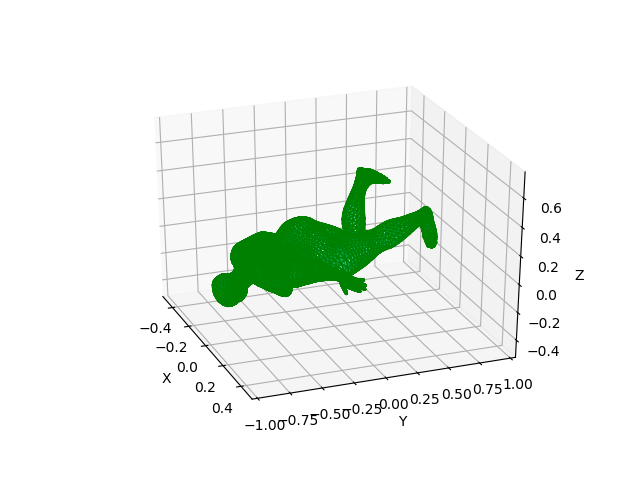
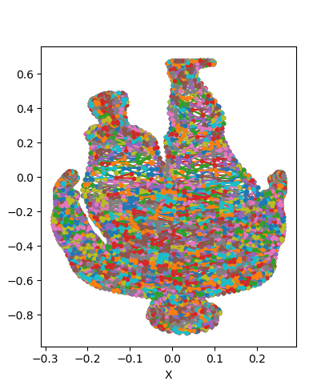

### 重要事项

- [ ] 完成项目
- [ ] 准备每周组会内容
- [ ] 交作业

# 周一

# 周二

# 周三

# 周四

# 周五

1.smpl坐标系和世界坐标系确认

我只需要在原点画出mesh 再标记出世界坐标轴xyz

回顾一下映射到屏幕的过程

1.读取点云 检查所有的点云

## 可视化trimesh

s=(0,0,-12)

2.trimesh = verts_3d[faces] 生成三角形mesh

## smesh可视化

2.怎么练习我的解释方法

# 周六

# 周天
去吃海底捞

[def]: img